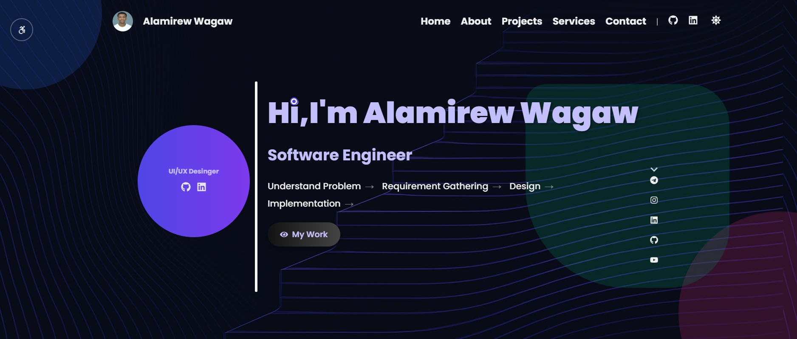
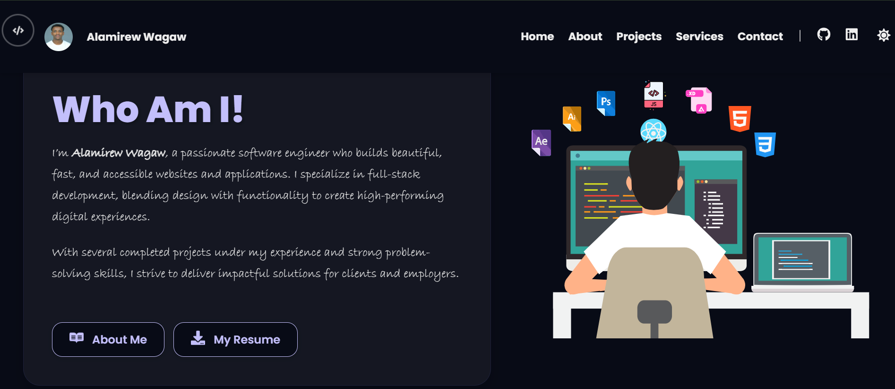
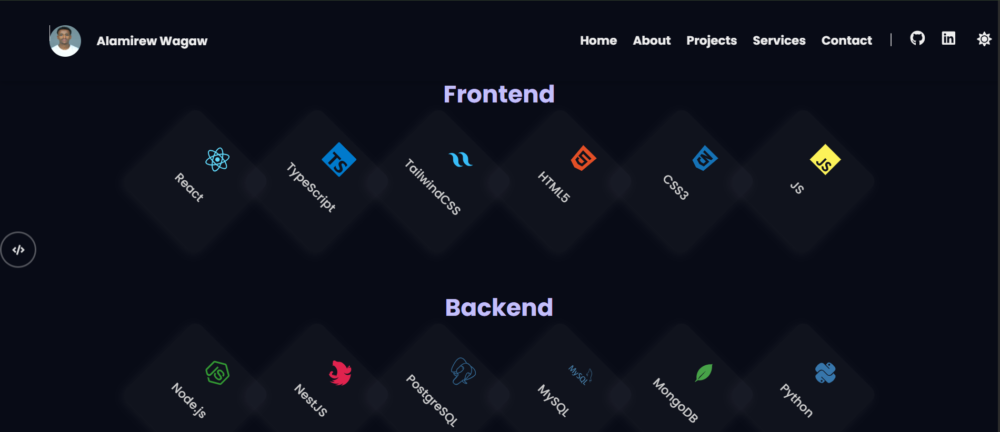

# Personal Developer Portfolio

Welcome to the repository for my Personal Developer Portfolio! This application is designed to showcase my expertise across multiple disciplines, including **Website Development**, **Software Engineering**, and **Artificial Intelligence/Machine Learning**. 

It features a custom, modern aesthetic with frosted glass UI elements, dynamic layouts, and an interactive experience to present methodology, project details, and source code.

## 🚀 Live Demo
[View Live Portfolio Here](https://alamirew.technosophia.net/)

---

## 💻 Tech Stack
This project is built using modern web development standards and optimized for speed and fluidity:
* **Frontend Framework:** React 18
* **Build Tool:** Vite
* **Styling:** Custom CSS (Modular, Utility-driven, Native CSS Variables for Theming)
* **Icons:** `react-icons` (FontAwesome, Feather Icons)
* **Animations:** Custom CSS Keyframes and native transitions

---

## ✨ Key Features
* **Multi-Discipline Project Showcase:** Distinct, beautifully rendered sections categorizing my top projects in Web Frontends, Microservices, and ML Models.
* **Interactive Modal Galleries:** Project cards trigger sleek glassmorphism modals displaying responsive, cross-fading image carousels instead of static views.
* **Component-Level Customization:** A global modular approach to components, meaning `WebDetails.jsx`, `SoftwareDetails.jsx`, and `AIDetails.jsx` act as individual service hubs.
* **Methodology Breakdown:** Process-flow ribbons indicating exactly how I tackle consulting from "Planning" to "Deployment".
* **Fully Responsive:** Tested and completely functional mapping to mobile, tablet, and widescreen monitors with adaptive grid systems and `aspect-ratio` locked elements.
* **Dedicated Data Layer:** Centralized structures (`WebDetails.jsx`, `ProjectData.js`) separating the UI layer from the data payloads for clean code maintenance.

---

## 📸 Screenshots

### Desktop Home View


### Project Modal Flow


### Methodology & Process Section


---

## 📦 Local Installation & Setup

If you'd like to run a local instance of this portfolio to test out the logic and animations, follow these steps:

1. **Clone the repository:**
   ```bash
   git clone https://github.com/alamir06/MyPortfolio.git
   ```

2. **Navigate to the directory:**
   ```bash
   cd MyPortfolio
   ```

3. **Install Dependencies:**
   ```bash
   npm install
   ```

4. **Start the Development Server:**
   ```bash
   npm run dev
   ```

5. Open up your browser and visit `http://localhost:5173/`

---

## 🤝 Contributing
This is an actively maintained personal portfolio, but feedback, styling tips, and optimizations are always welcome.

## 📄 License
This project is open-source and available under the terms of the [MIT License](LICENSE).
